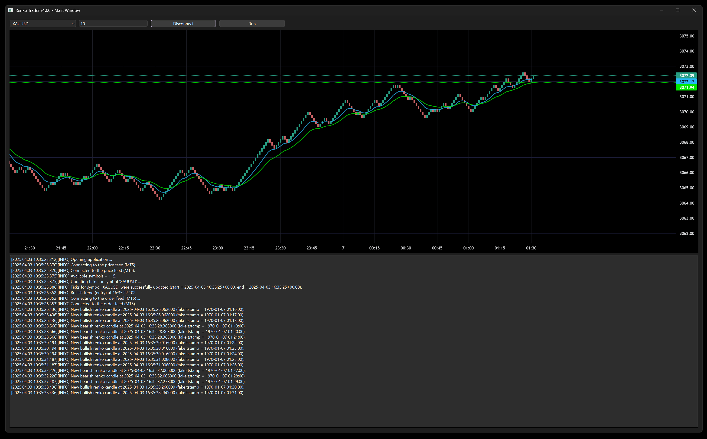

# renko-trader
A complete trading app written in Python that interacts with MetaTrader 5 to fetch price, draw renko candlesticks in real-time and open/close positions when a moving average crossover occurs.



## 1 - Setup
1.1 - MetaTrader 5 should be installed and logged in with a valid account (demo or live). Enable 'Algo Trading' in MT5 to accept positions sent by the app.

1.2 - After cloning the repo, create a virtual environment and install the required libraries.
```
$ pip install -r requirements.txt
```

1.3 - The moving averages were built using [pandas-ta](https://github.com/twopirllc/pandas-ta) library, which uses a deprecated version of numpy. To work around this [issue](https://github.com/twopirllc/pandas-ta/issues/799), locate the 'pandas-ta/momentum/squeeze_pro.py' file in your virtual environment and change the line
```
from numpy import NaN as npNaN
```
to
```
from numpy import nan as npNaN
```

1.4 - Make sure the MT5 path ('price_feed/MT5/path') in the 'config.json' file matches the MT5 terminal's executable installed in your machine.

## 2 - Usage
2.1 - Run the application using 'main.py'. Click the 'Connect' button to start the chart and the 'Run' button to enable the trading strategy.

2.2 - Upon successful connection, the app will build and display renko bricks and the two moving averages in the chart. The amount of renko bricks and time taken to plot them will be determined by the symbol, brick size (in points) and lookback (hours) from the config file or the symbol and brick size in the main window. 

2.3 - When selecting a new symbol in the drop-down menu or changing the brick size, the app will automatically disconnect from the price feed and refresh the chart. Connect again to update the chart with the new symbol/brick size.

2.4 - Unlike regular candlesticks, renko bricks are constrained by size and not time. In order to draw the renko candles using the [lightweight-charts-python](https://github.com/louisnw01/lightweight-charts-python) library, a fake 1-minute timestamp reference is used, but the real time reference is also stored and used for opening and closing positions. 

2.5 - Several messages will be shown in the terminal box and saved in the 'log.txt' file. Message timestamps use the host timezone.

2.6 - The trading strategy was solely included to demostrate the app's behavior end-to-end and should not be used in production without rigorous forward testing. For the entry logic, when the moving average #1 (fast) crosses above moving average #2 (slow), a long position will be requested and all short opened positions done by the app will be closed. When the moving average #1 crosses below moving average #2, a short position will be requested and all long positions done by the app will be closed. 

2.7 - If the trading period is enabled ('strategy/filter/trading_period/enabled': 1 in 'config.json'), the app will only send orders between 'start' and 'end' timestamps (MT5 server's time) and it will close all opened positions when 'end' has been reached. If disabled, the app will trade any time. 

2.8 - Break even parameters are included, but not the logic.

