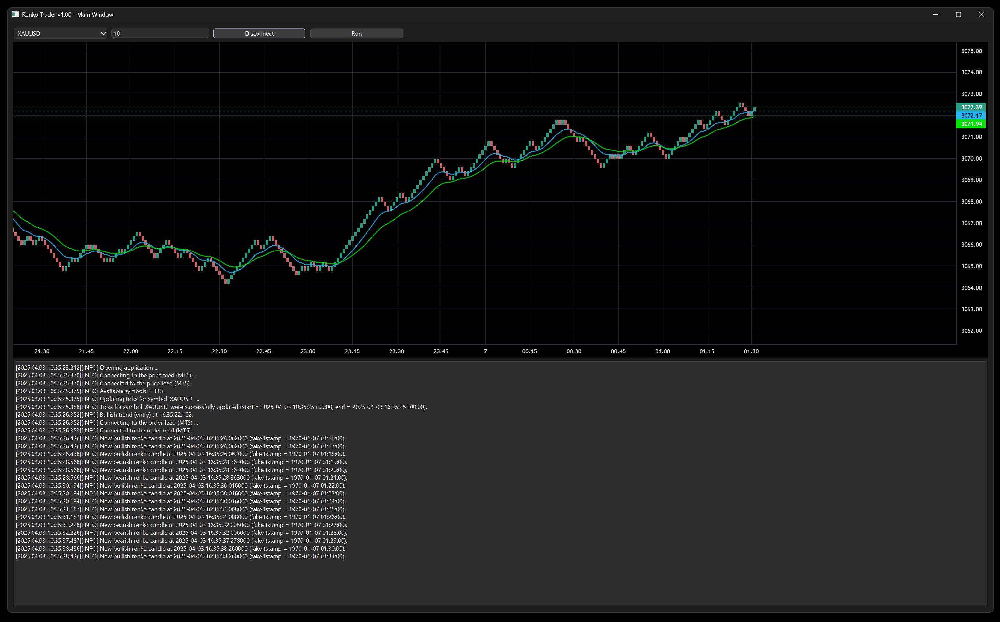

# Renko Trader

Renko Trader is a Python and MetaTrader 5 project for visualizing market data, building Renko charts, calculating technical indicators, and testing automated trading workflows.

The repository contains two implementations of the project. Each version has its own architecture and documentation.

> **Warning:** This project is a technical demonstration and educational prototype. It is not production-ready trading software. It is not investment advice and does not guarantee performance or profitability. Test thoroughly in a demo environment before considering any live use. You are responsible for validating all configuration values, broker-specific trading constraints, and order results.

## Versions

### [Version 1](v1/v1_README.md)

A standalone Python desktop application that connects directly to MetaTrader 5 through the Python `MetaTrader5` package.

Main components:

- PySide6 desktop GUI.
- Live MT5 price feed.
- Renko-brick generation.
- Lightweight Charts visualization.
- EMA-based Moving Average Crossover strategy.
- MT5 position management from Python.

Read the full technical documentation: **[v1/v1_README.md](v1/v1_README.md)**.

### [Version 2](v2/v2_README.md)

A hybrid architecture where the Python application handles visualization, candle/Renko processing, indicators, and strategies, while an MQL5 Expert Advisor handles MetaTrader 5 data streaming and order execution.

Main components:

- PySide6 Python desktop application.
- TCP/JSON communication layer.
- MQL5 Expert Advisor (`RT_EA`).
- Startup handshake and chunked historical-data transfer.
- Regular-candle and Renko modes.
- Modular indicator and strategy discovery.
- EA-managed order execution and position handling.

Read the full technical documentation: **[v2/v2_README.md](v2/v2_README.md)**.

## Version Comparison

| Feature | Version 1 | Version 2 |
|---|---|---|
| Primary architecture | Python application directly integrated with MT5 | Python application + MQL5 Expert Advisor |
| MetaTrader 5 integration | Python `MetaTrader5` package | TCP socket communication with an MQL5 EA |
| GUI | PySide6 | PySide6 |
| Charting | Lightweight Charts | Lightweight Charts |
| Price source | MT5 price-feed worker in Python | EA streaming through TCP |
| Chart modes | Renko | Regular candles and Renko |
| Indicators | Built-in EMA processing | Modular, configuration-driven indicator engine |
| Strategy | Moving Average Crossover | Modular strategy engine with Moving Average Crossover |
| Historical initialization | Python retrieves MT5 history | EA transfers history in acknowledged chunks |
| Trade execution | Python position manager submits MT5 orders | MQL5 EA receives commands and submits MT5 orders |
| Connection resilience | Application-level MT5 connection handling | Handshake, acknowledgements, retries, and reconnection flow |

## Getting Started

Choose the version that matches your intended workflow:

- Use **[Version 1](v1/v1_README.md)** for the direct Python-to-MetaTrader 5 architecture.
- Use **[Version 2](v2/v2_README.md)** for the separated Python application and MQL5 EA architecture.

Refer to the version-specific README for setup instructions, configuration, operational details, and technical architecture.
