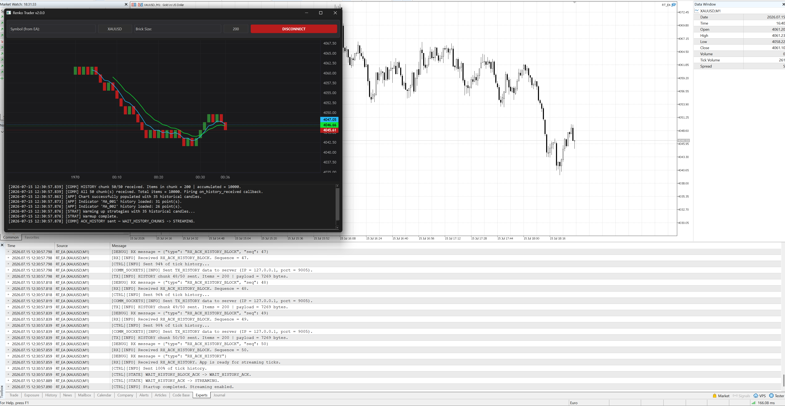

# Renko Trader v2

Renko Trader v2 is a hybrid trading application that combines a Python desktop application with a MetaTrader 5 Expert Advisor (EA). The Python application provides the graphical interface, chart rendering, candle/Renko processing, indicators, and strategy execution. The EA streams market data, receives trading commands through TCP, and submits orders inside MetaTrader 5.

> **Warning:** This project is a technical demonstration and educational prototype. It is not production-ready trading software. It is not investment advice and does not guarantee performance or profitability. Test thoroughly in a demo environment before considering any live use. You are responsible for validating all configuration values, broker-specific trading constraints, and order results.



## Features

- Python desktop interface built with PySide6.
- Live charting with Lightweight Charts.
- Regular-candle and Renko-brick processing.
- Historical warmup followed by live market-data streaming.
- Modular, configuration-driven indicator discovery.
- Modular strategy discovery and execution.
- Moving Average Crossover strategy included.
- TCP socket communication between the Python application and an MQL5 EA.
- Chunked historical-data transfer with startup acknowledgements.
- Optional automated order execution through MetaTrader 5.
- Configurable lot size, stop loss, take profit, magic number, asynchronous execution, and close-on-opposite-signal behavior.

## Architecture

```text
MetaTrader 5 Terminal
        │
        │ runs
        ▼
RT_EA (MQL5 Expert Advisor)
        │
        │ TCP / JSON frames
        │ EA = TCP client | Python app = TCP server
        ▼
Python Desktop Application
        ├── Communication server and protocol handler
        ├── Candle or Renko engine
        ├── Indicator engine
        ├── Strategy manager
        ├── Chart renderer
        └── GUI and application log
```

The Python application and the EA have separate responsibilities:

| Component | Responsibilities |
|---|---|
| Python application | Starts the TCP server, renders the GUI and chart, processes historical/live data, builds candles or Renko bricks, calculates indicators, evaluates strategies, and sends trading commands. |
| MQL5 EA | Connects to the Python server, transfers startup metadata and historical/live market data, receives commands, and executes/ closes positions through MetaTrader 5. |

## Repository Layout

```text
v2/
├── app/
│   ├── main.py
│   ├── config.json
│   ├── requirements.txt
│   └── src/
│       ├── comm/          # TCP server, protocol, message handling
│       ├── config/        # Application configuration
│       ├── GUI/           # GUI, chart, candles, Renko, logger
│       ├── indicators/    # Indicator discovery and implementations
│       ├── strategy/      # Strategy discovery and implementations
│       └── shared/        # Shared signal and command constants
├── RT_EA/
│   ├── RT_EA.mq5          # MetaTrader 5 Expert Advisor entry point
│   ├── EA_vars.mqh        # EA inputs, constants, and shared variables
│   └── Modules/
│       ├── Comm/          # Socket communication
│       ├── Controller.mqh # Startup and streaming state machine
│       ├── JSON/          # Minimal JSON builder
│       ├── RX/            # Incoming commands and acknowledgements
│       ├── TX/            # Outgoing market data and history
│       └── Positions/     # Trade execution and position closing
└── docs/
    └── v2-blueprint.md
```

## Requirements

### Python application

- Python 3.10 or newer is recommended.
- MetaTrader 5 terminal installed and available on the same machine when running the EA locally.
- Dependencies listed in `app/requirements.txt`.

Key Python packages include:

- `PySide6`
- `lightweight-charts`
- `pandas`
- `numpy`
- `pandas_ta`
- `MetaTrader5`

### MetaTrader 5

- MetaTrader 5 terminal.
- A compiled version of `RT_EA.mq5` attached to a chart.
- Algo Trading enabled when trade execution is intended.
- Socket permissions/settings compatible with the EA communication module.

## Installation

### 1. Create and activate a Python environment

From the `v2/app` directory:

```bash
python -m venv .venv
```

Activate it:

```bash
# Windows PowerShell
.\.venv\Scripts\Activate.ps1
```

```bash
# Windows Command Prompt
.venv\Scripts\activate.bat
```

```bash
# Linux/macOS
source .venv/bin/activate
```

### 2. Install Python dependencies

```bash
pip install -r requirements.txt
```

### 3. Configure the Python application

Review `app/config.json` and the configuration module under `app/src/config/` before starting the application. In particular, ensure that the communication host and port match the EA settings.

### 4. Compile and attach the EA

1. Open MetaEditor from MetaTrader 5.
2. Open `RT_EA/RT_EA.mq5` with its required include files available in the expected project structure.
3. Compile the EA.
4. Attach the compiled EA to the chart and symbol you intend to use.
5. Configure the EA inputs described in [EA Inputs](#ea-inputs).

## Running the System

Start the Python application before starting the EA connection.

```bash
python main.py
```

Recommended sequence:

1. Start MetaTrader 5.
2. Start the Python application from `v2/app`.
3. Click **Connect** in the application to start the TCP server.
4. Attach or initialize `RT_EA` on the intended MetaTrader 5 chart.
5. Confirm that the EA connects to the configured host and port.
6. Wait for startup metadata and historical data to finish loading.
7. Verify the displayed symbol, candle type, brick size, chart, indicators, and log output.
8. Enable trading only after validating all EA and platform settings.

## Connection and Startup Protocol

The Python application listens for a TCP connection. The EA acts as the TCP client.

Messages are JSON objects separated by the following frame delimiter:

```text
<FRAME_END>
```

The controller in the EA follows this startup state machine:

```text
DISCONNECTED
    → WAIT_START_ACK
    → WAIT_HISTORY_BLOCK_ACK
    → WAIT_HISTORY_ACK
    → STREAMING
```

### Startup flow

1. The EA connects to the Python TCP server.
2. The EA sends `TX_START` with session metadata, including symbol, candle type, timeframe, Renko brick size, tick size, and symbol digits.
3. The application creates the matching candle engine and sends `RX_ACK_START`.
4. The EA sends `TX_HISTORY_META` followed by `TX_HISTORY` chunks.
5. The application reconstructs and processes the historical data, loads the chart, initializes indicators, and warms up strategies.
6. The application acknowledges each history chunk with `RX_ACK_HISTORY_BLOCK`.
7. After all chunks are processed, the application sends `RX_ACK_HISTORY`.
8. The EA enters `STREAMING` and sends `TX_DATA` messages on new ticks.

The protocol uses acknowledgement timeouts, configurable retransmissions, reconnection backoff, and partial-history fallback behavior to improve resilience during startup.

## Market Data Processing

### Regular candles

For regular candles, the current candle is updated on every incoming tick. Indicators and strategies are evaluated only when a new candle timestamp is detected, meaning the preceding candle has closed.

### Renko bricks

For Renko mode, incoming ticks are accumulated by the Renko engine. A price movement large enough to form one or more completed bricks returns those bricks for chart, indicator, and strategy processing.

A single market tick can create multiple Renko bricks. Each completed brick is processed individually.

### Historical warmup

Historical data initializes the chart, indicators, and strategy state. Signals detected during warmup are not used to send trading commands. This prevents an old historical condition from triggering a new order immediately after startup.

## Indicators and Strategies

### Indicator engine

Indicators are discovered from the `app/src/indicators/` directory through their configuration files. An indicator implementation is expected to support historical initialization and incremental updates.

The included moving-average implementation calculates exponential moving averages (EMAs), using historical processing for initialization and incremental updates for live closed candles/bricks.

### Strategy engine

Strategies are discovered from the `app/src/strategy/` directory and are loaded according to active indicator configuration.

The included Moving Average Crossover strategy evaluates the configured fast and slow EMA series. In the current implementation, the active strategy binding uses EMA periods `5` and `10`.

Trading signals are emitted only after a completed candle or Renko brick is processed.

## Trading Commands and Execution

The Python application sends strategy output to the EA through the communication layer.

| Strategy signal | EA command |
|---|---|
| `SIG_LONG` | `LONG_OPEN` |
| `SIG_SHORT` | `SHORT_OPEN` |

A command is transmitted as a JSON message conceptually equivalent to:

```json
{"type":"CMD","value":"LONG_OPEN"}
```

or:

```json
{"type":"CMD","value":"SHORT_OPEN"}
```

The EA receives the command and delegates it to its position-management module.

### Long command behavior

For `LONG_OPEN`, the EA:

1. Optionally closes open sell positions associated with the configured magic number.
2. Reads the current `ASK` price.
3. Calculates stop loss below the entry price.
4. Calculates take profit above the entry price.
5. Sends a buy request through `CTrade`.

### Short command behavior

For `SHORT_OPEN`, the EA:

1. Optionally closes open buy positions associated with the configured magic number.
2. Reads the current `BID` price.
3. Calculates stop loss above the entry price.
4. Calculates take profit below the entry price.
5. Sends a sell request through `CTrade`.

Stop-loss and take-profit distances are configured in points and converted using the symbol trade tick size.

> Sending a command does not guarantee order execution. Execution depends on terminal state, account permissions, market conditions, symbol specifications, volume constraints, broker rules, filling policy, and other MetaTrader 5 conditions.

## EA Inputs

The EA exposes the following primary inputs in `EA_vars.mqh`.

### Connection

| Input | Default | Description |
|---|---:|---|
| `str_inp_host` | `127.0.0.1` | Python server host/IP address. |
| `i_inp_port` | `9005` | Python server port. |
| `i_inp_timer_period_ms` | `16` | EA timer interval in milliseconds. |
| `i_inp_lookback_startup_candles` | `100` | Number of startup candles or ticks requested. |

### Chart setup

| Input | Default | Description |
|---|---:|---|
| `en_inp_ct_curr` | `en_cd_regular` | Candle mode: regular (`0`) or Renko (`1`). |
| `i_inp_renko_brick_size` | `1000` | Renko brick size in points. |

### Startup and recovery

| Input | Default | Description |
|---|---:|---|
| `i_inp_startup_ack_timeout_ms` | `2000` | Timeout for each startup acknowledgement step. |
| `i_inp_startup_max_retries` | `5` | Maximum startup retransmissions before reset. |
| `i_inp_reconnect_backoff_ms` | `1000` | Minimum interval between reconnection attempts. |

### Watchdog

| Input | Default | Description |
|---|---:|---|
| `i_inp_watchdog_tx_window_ms` | `30000` | Transmission activity window. |
| `i_inp_watchdog_rx_timeout_ms` | `60000` | Receive-silence timeout. |

### Trading

| Input | Default | Description |
|---|---:|---|
| `b_inp_trade_enabled` | `true` | Enables trade setup in the EA. |
| `b_inp_trade_close_on_opp` | `true` | Closes positions in the opposite direction before opening a new one. |
| `b_inp_trade_async_enabled` | `true` | Enables asynchronous `CTrade` mode. |
| `l_inp_magic_number` | `1001` | Magic number used to identify EA positions. |
| `d_inp_lot_size` | `0.01` | Requested trade volume. |
| `d_inp_SL_points` | `500` | Stop-loss distance in points. |
| `d_inp_TP_points` | `500` | Take-profit distance in points. |

## Extending the Project

### Add an indicator

1. Create an indicator directory under `app/src/indicators/`.
2. Add the implementation module.
3. Add an `ind_config_<ID>.json` configuration file.
4. Implement historical and incremental processing methods compatible with the indicator engine.
5. Enable the indicator in its configuration.

### Add a strategy

1. Create a strategy module under `app/src/strategy/`.
2. Add the corresponding strategy configuration.
3. Bind the strategy to the required active indicators.
4. Return standard signal payloads compatible with the GUI and communication manager.

### Add a chart type

Implement a candle-processing engine compatible with the GUI pipeline, then select it through startup metadata and the EA candle-type configuration.

## Operational Notes

- Keep the Python server and EA host/port settings aligned.
- Start the Python server before expecting the EA to connect.
- Verify the chart symbol, brick size, timeframe, and indicator configuration after startup.
- Use a unique magic number for each independent EA setup.
- Validate that the requested lot size, stop-loss, and take-profit values comply with the symbol and broker specifications.
- Use a demo account and review platform logs before any live deployment.
- Do not treat a strategy signal, TCP command, or trade-request submission as a guaranteed fill confirmation.

## License

This project is distributed under the repository's [LICENSE](../LICENSE).